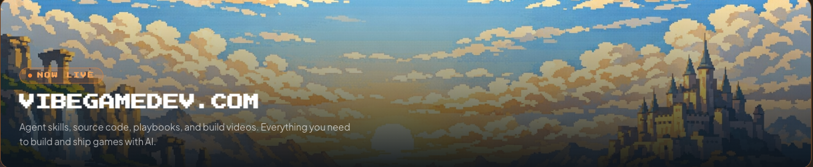

# TicTac — Vibe-Coded Isometric Sprites

> AI-generated 8-way isometric character sprites for a tactics game, built with **Claude Code**, **Codex**, and **fal.ai Nano Banana 2**.

> As seen on **["I Vibe Coded Isometric Pixel Art Sprites for My Tactics Game"](https://www.youtube.com/watch?v=03Xsy18Hsdo)**

> **Full game repos, agent skills, playbooks & build videos** — [vibegamedev.com](https://vibegamedev.com?utm_campaign=vgd-02&utm_source=github&utm_medium=readme)

&nbsp;&nbsp;

---

## About

This repository documents the full pipeline for generating 8-way isometric character sprites using AI coding assistants (Claude Code, OpenAI Codex) and fal.ai's Nano Banana 2 image model.

The adventurer character progresses through turnaround sheets, direction-frame extraction, and normalization — driven by AI agent sessions with full prompt, plan, and learning archives.

---

## What's in this repo vs [VibeGameDev](https://vibegamedev.com?utm_campaign=vgd-02&utm_source=github&utm_medium=readme-comparison)

| | This Repo (Free) | [VibeGameDev.com](https://vibegamedev.com?utm_campaign=vgd-02&utm_source=github&utm_medium=readme-comparison) |
|---|---|---|
| fal.ai image generation skill | ✅ | ✅ |
| Isometric turnaround prompts | ✅ | ✅ |
| Plans & learnings | ✅ | ✅ |
| fal.ai **video** generation skill | — | ✅ |
| Walk cycle animation pipeline | — | ✅ |
| Full source code of all projects | — | ✅ |
| Game Dev Asset Tools (normalize, stitch, flip) | — | ✅ |
| All playbook articles | — | ✅ |
| Private Discord | — | ✅ |
| Lifetime updates | — | ✅ |

> 👉 [**Get VibeGameDev — launch price**](https://vibegamedev.com?utm_campaign=vgd-02&utm_source=github&utm_medium=readme-cta)

---

## What's in this repository

### Agent Skills

The `fal-ai-image` skill for AI-assisted sprite generation, available for all three agent platforms:

- **`.claude/skills/fal-ai-image/`** — for [Claude Code](https://claude.ai/code)
- **`.codex/skills/fal-ai-image/`** — for [OpenAI Codex](https://openai.com/codex) / Codex CLI
- **`.agents/skills/fal-ai-image/`** — for custom agents

Includes model presets, experiment matrix, queue-based inference scripts, and prompt profiles for fal.ai image generation.

### Assets

- `public/assets/tictac/` — 8-way isometric character outputs (cardinal/diagonal direction sheets, turntable GIFs, normalized frames, portraits)

### Experiments

- `experiments/fal-image/` — fal.ai image generation runs for the adventurer turntable pipeline (request/response pairs with output PNGs)

### Plans, Learnings & Prompts

Session records for the TicTac adventurer 8-way turntable pipeline:
- `plans/` — feature design document written before implementation
- `learnings/` — engineering notes captured after implementation
- `prompts/` — exact prompts used during AI-assisted development

---

## Tech Stack

- **Claude Code** + **OpenAI Codex** — AI coding assistants driving the pipeline
- **fal.ai Nano Banana 2** — isometric turnaround sheet generation
- **Python** — post-processing scripts (direction frame extraction, normalization)
